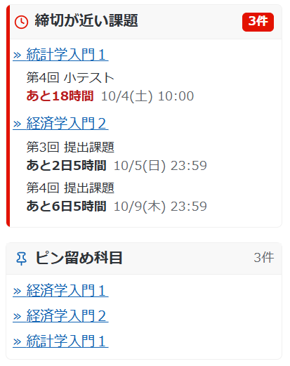
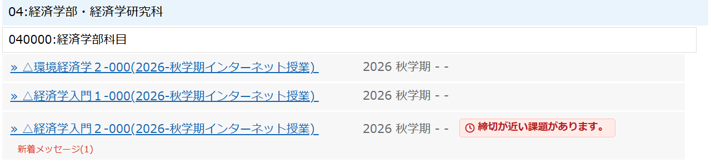
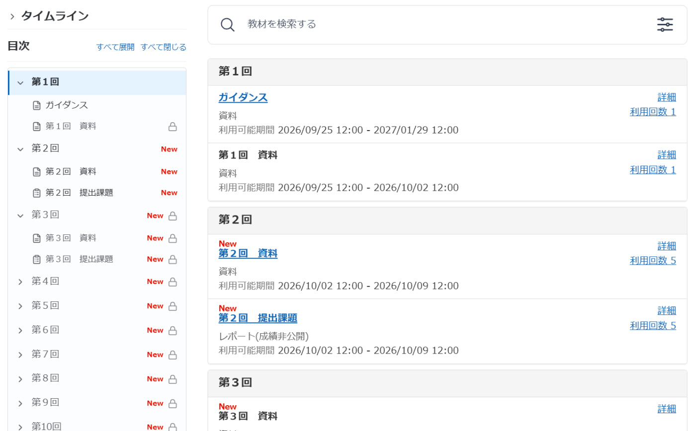
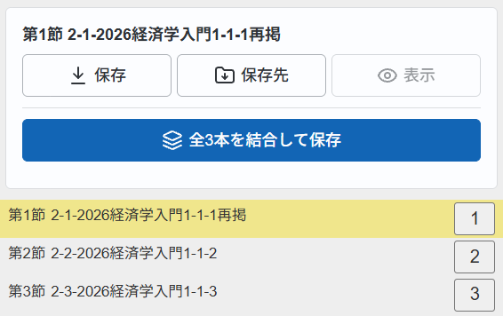
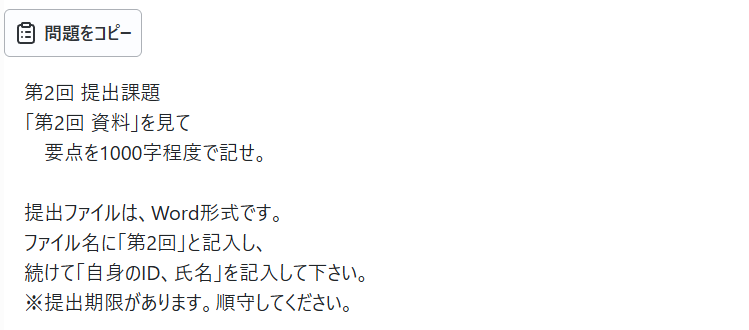
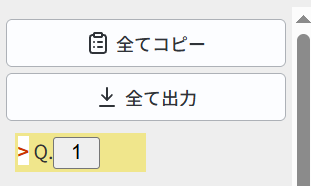
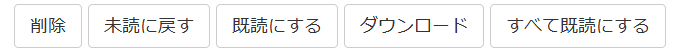
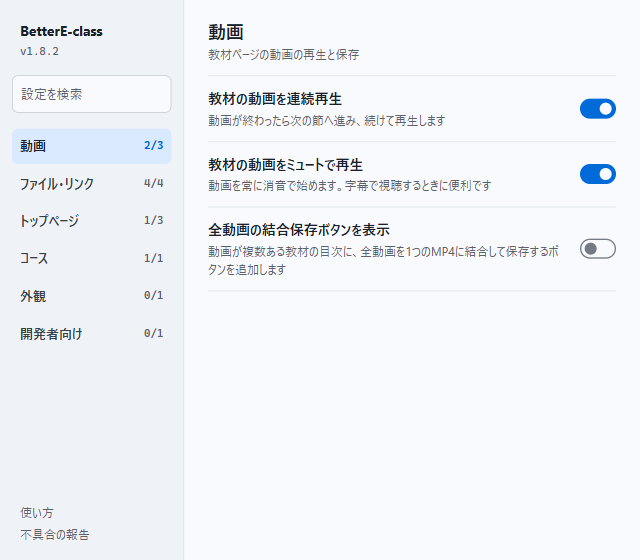

<div align="center">


# BetterE-class

同志社大学の e-class（WebClass）を、もっと使いやすく。

[](https://github.com/kmch4n/BetterE-class/releases/latest)
[](https://github.com/kmch4n/BetterE-class/releases)

[](LICENSE)

[**ダウンロード**](https://github.com/kmch4n/BetterE-class/releases/latest) ・ [インストール](#インストール) ・ [機能の詳細](docs/BetterE-class.md) ・ [不具合の報告](https://github.com/kmch4n/BetterE-class/issues)

</div>

締切の確認、教材の保存、動画の視聴、クイズの書き出しといった日々の操作を、e-class の画面になじむ形で補う Chrome 拡張機能です。

> [!NOTE]
> 同志社大学および e-class の運営とは関係のない、個人による非公式の開発です。

## できること

| 機能 | 内容 |
|---|---|
| **締切が近い課題** | トップページに未提出の課題と残り時間を一覧表示 |
| **ピン留め科目** | よく使う科目を一覧の先頭に固定 |
| **コースの目次** | 回ごとの目次を左の列に表示し、読んでいる回を追従 |
| **教材と動画の保存** | 資料をワンクリックで保存。配信動画も MP4 に変換して保存 |
| **動画の連続再生** | 動画が終わると次の節へ進んで再生を続ける |
| **クイズの書き出し** | 問題をコピー、または全問をまとめてテキストに保存 |
| **メッセージ** | 受信箱をまとめて既読に。ポップアップではなくタブで開く |
| **外観** | 時間割表の土曜日・6・7限を隠す、ダークモード（ベータ版） |

## 画面

画面写真の科目名・氏名は架空のものに置き換えています。

### 締切とよく使う科目



科目一覧の左側に、締切が近い課題を一覧で表示します。未提出の課題名と、締切までの残り時間・締切日時がわかり、残り24時間を切ると赤字になります。

よく使う科目はピン留めしておくと、すぐ下に並びます。

e-class が出す「締切が近い課題があります。」の表示も、時計の印が付いた札として見つけやすくします。

<br clear="right">



### コースページの目次



コースページの左の列に、回ごとの目次を表示します。読んでいる回とその前後が開き、スクロールに合わせて切り替わります。新しい教材には「New」、利用できない教材には鍵の印が付きます。

### 教材の保存と動画



教材ページの目次の上に、選んでいる節の資料を保存・プレビューするパネルを置きます。配信形式の動画も MP4 に変換して保存でき、節ごとに分かれた動画を1本につなげて保存することもできます。変換はすべてブラウザの中で行います。

- 動画が終わると次の節へ進んで再生を続けられます（設定でオン）
- ミュートにした状態は次の動画にも引き継がれます
- 添付ファイルやレポートは、別ウインドウではなく新しいタブで開きます

<br clear="right">

### クイズと課題

<table>
<tr>
<td width="68%"></td>
<td></td>
</tr>
<tr>
<td>表示している問題を、問題文と選択肢ごとクリップボードにコピーできます。問題文は画面どおりの改行で取り出します。</td>
<td>すべての問題を順に表示して集め、まとめてコピーするかテキストファイルに保存します。</td>
</tr>
</table>

### メッセージ



受信箱に「すべて既読にする」を加え、表示中のページのメッセージをまとめて既読にできます。

### 設定



ツールバーのアイコンから設定を開きます。機能はカテゴリごとに分かれていて、検索欄から探すこともできます。切り替えた設定はその場で保存されます。

すべての機能と細かな挙動は [docs/BetterE-class.md](docs/BetterE-class.md) にまとめています。

## インストール

BetterE-class は [GitHub Releases](https://github.com/kmch4n/BetterE-class/releases) で配布しています。Chrome の「パッケージ化されていない拡張機能」として読み込んで使います。

1. [最新リリース](https://github.com/kmch4n/BetterE-class/releases/latest)から `BetterE-class_vX.Y.Z.zip` をダウンロードする
2. zip を展開し、中身を置いておくフォルダ（例: `ドキュメント\BetterE-class`）に移す
3. Chrome で `chrome://extensions/` を開き、右上の「デベロッパー モード」をオンにする
4. 「パッケージ化されていない拡張機能を読み込む」を押し、手順2のフォルダを選ぶ
5. ツールバーのパズルアイコンから BetterE-class をピン留めしておくと、設定をすぐに開けます

> [!IMPORTANT]
> 読み込んだフォルダは削除・移動しないでください。Chrome はそのフォルダから拡張機能を読み込み続けます。フォルダの場所が変わると別の拡張機能として扱われ、設定やピン留めした科目が引き継がれません。

### 更新

自動では更新されません。新しいリリースが出たら、次の手順で入れ替えます。

1. 新しい zip をダウンロードして展開する
2. 読み込んでいるフォルダの中身を、展開したファイルで上書きする
3. `chrome://extensions/` で BetterE-class の再読み込みボタン（↻）を押す

> [!TIP]
> リポジトリ右上の **Watch → Custom → Releases** をオンにすると、新しいリリースが出たときに GitHub から通知が届きます。

> [!NOTE]
> Chrome ウェブストア版を使っていた場合は、そちらを削除してから読み込んでください。両方が有効だと機能が二重に動きます。ストア版の設定は引き継がれないため、設定画面で選び直してください。

## データの扱い

- 処理はすべてブラウザの中で行い、e-class（`eclass.doshisha.ac.jp`）以外とは通信しません
- 設定やピン留めした科目は、ブラウザの拡張機能用ストレージ（`chrome.storage.local`）に保存します
- 締切の詳細は、e-class 自身の「課題実施状況一覧」と同じデータをログイン中のセッションで読み取っています

| 権限 | 用途 |
|---|---|
| `storage` | 設定とピン留めの保存 |
| `downloads` | 教材・添付ファイル・動画の保存 |
| `tabs` | 設定を変えたときに、開いている e-class のタブへ反映する |
| `declarativeNetRequest` | ファイルをダウンロードではなくブラウザ内で表示する |
| `clipboardWrite` | クイズの問題のコピー |

## 開発に参加する

不具合の報告、要望、Pull Request を歓迎します。

- 開発の進め方と決まりごと: [CONTRIBUTING.md](CONTRIBUTING.md)
- 不具合の報告・要望: [Issues](https://github.com/kmch4n/BetterE-class/issues/new/choose)
- 脆弱性の報告: [SECURITY.md](SECURITY.md)
- 実装の詳細: [docs/TechNote.md](docs/TechNote.md)

ビルドは不要で、`extension` フォルダがそのまま拡張機能になります。リポジトリを取得し、上の手順4で `extension` フォルダを読み込めば手元のソースで動きます。

```bash
node --test tests/*.test.js
```

> [!WARNING]
> e-class の画面構成が変わると、予告なく動かなくなることがあります。利用は各自の判断でお願いします。本拡張機能の利用によって生じた損害について、作者は責任を負いません。
